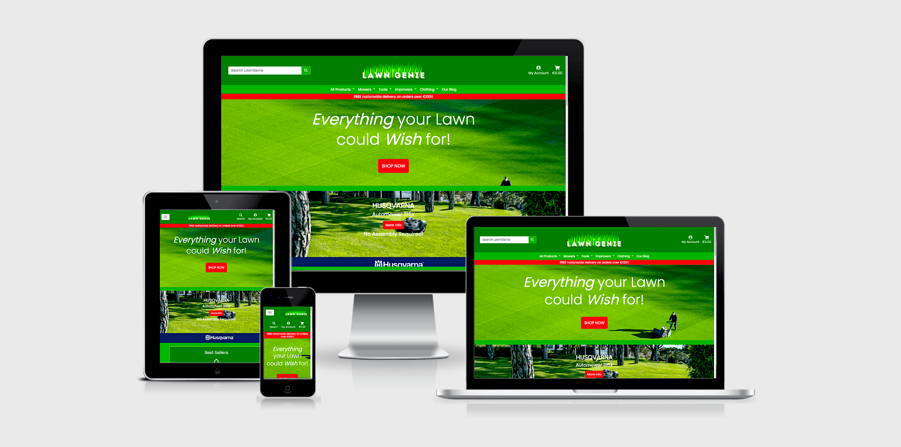
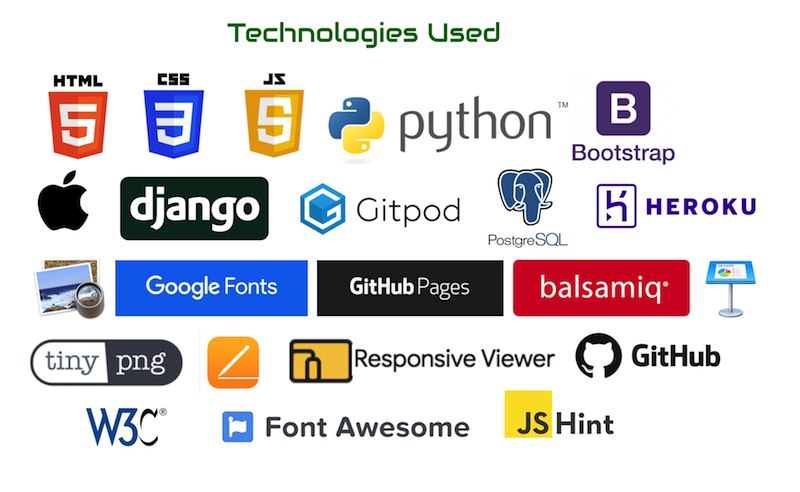

#####   #####

# LawnGenie.ie #
## 'Everything your Lawn could Wish for!' An e-commerce web application for selling products relating to Lawn Care & Maintenance ## 
### Purpose: Full Stack Development Project (Milestone Project 4) for the Diploma in Software Development course at [Code Institute](https://codeinstitute.net/) ###
### Developer: Andrew McDonald - Contact me on GitHub :octocat: @ <a href="https://github.com/AndyMc3000"><strong>AndyMc3000</strong></a> ###
### LawnGenie Website deployed on Heroku: [Click Here To Visit](https://lawngenie.herokuapp.com/) ###
#####   #####

## Table of Contents ##
1. [Introduction](#introduction-heading)
1. [User Experience Design (UX)](#user-experience-design)
1. [Website Features](#website-features)
1. [Technologies Used](#technologies-used)
1. [Testing](#testing)
1. [Deployment](#deployment)
1. [Credits](#credits)

####   ####
## 1. <a name="introduction-heading">Introduction</a> ##
####   ####

The LawnGenie.ie web application is my Milestone 4 (MS4) project for the Diploma in Fullstack Software Development course at Code Institute. The underlying goal of the project is to meet and exceed the requirements laid out for the MS4 project by Code Institute. The high-level requirement of the MS4 project is to "..build a full-stack site based around business logic used to control a centrally-owned dataset. You will set up an authentication mechanism and provide paid access to the site's data and/or other activities based on the dataset, such as the purchase of a product/service." 

LawnGenie.ie represents a project I have undertaken for a fictional client. I have been hired to develop an e-commerce store for a Garden Centre who want a specialist website which focuses on selling products related to the care and maintenance of lawns. 

### User Accounts  ###

All of the LawnGenie website features and functionality can be tested using one or other of the below User Accounts.

* SuperUser - Website Admin and Django Admin Account
  * UN: johndeere
  * PW: husqvarna

* Registed Customer Account
  * UN: larrylawn
  * PW: greenfingers

#### [Back To Top ^ ](#top-of-page) ####

####   ####
## 2. <a name="user-experience-design">User Experience Design (UX)</a> ##
####   ####

The design of the LawnGenie.ie e-commerce website was determined by assessing and quantifying the goals and objectives of the business owners, as well as the requirements of users who will visit and use the website. 

Following the determination of client and user stories, and their subsequent technical requirements, the site was designed using the principles of Jesse James Garrett's '5 Planes of UX Design'. The outcome or tasks created for each of the 5 design planes is outlined below.

### 1. The Strategy Plane ###

The Strategy Plane, as defined by Jesse James Garrett "..incorporates not only what the people running the site want to get out of it but what the users want to get out of the site as well." 

Please see below details of 'Client Stories' to detail the requirements of the LawnGenie.ie business owners, and 'User Stories' which highlight the requiremnts of the website users.

#### Client Stories ####
> - [x] "The business owners want to; "Create a specialist e-commerce store which sells products relating to the care and maintenance of Lawns."
> - [x] "The store must provide the business owners with an easy to use interface to enable to addition, editing, and deletion of products and their content. This content must include a product name, SKU, category, description, price, a product image, and rating. The interface should also allow for the addition of other attributes which may be unique to certain products, for example, a 'size' attribute for boots."
> - [x] "The store must use the Stripe payment processing platform to ensure an elegant and secure payment process for users."
> - [x] "The store design must allow users to navigate easily and intuitively through the product offering, regardless of what device they are using."
> - [x] "For ease of use, the store must allow users of the site to register and login so that they can store their personal delivery/account information and. This is to facilitate quick purchaing transactions. They should also be able to view their past order history."
> - [x] “The store must give users the option to subscribe to an email mailing list. Marketing/promotional emails can then be sent to users based on topics such as; tips and tricks from gardening professionals and lawn care specialists, new product infromation, and special offers."
> - [x]  “The store must have a blog section where users can read articles and get information about lawn care and maintenance etc. A secure interface to add, update, and delete blog posts must be provided to the business owners."
> - [x] “The store must contain a number of product categories of products which should be easily accessible and identifiable to a user." These categories are;
* Category 1 - Mowers:  
   * Robot Mowers
   * Self-propelled
   * Push Mowers
   * Tractor Mowers 
* Category 2 - Tools:
   * Rakes
   * Edging Tools
   * Aerators
   * Watering
   * Hand Tools
   * Sprayers
* Category 3 - Improvers:
   * Lawn Feed
   * Weeding
   * Seeds
* Category 4 - Clothng:
   * Jackets
   * Trousers
   * Boots
   * Gloves

#### User Stories ####
> - [x] “I want to learn to immediately understand the overall concept of what the website offers when I land on the homepage, i.e. the online sale of lawn care equipment and associated products.”
> - [x] “I want to be able to access all product categories from every page.”
> - [x] “I want to be able to view a list of all products in a category.”
> - [x] “I want to be able to easily search for products from every page."
> - [x] “I want to be able to easily sort product listings by price, name, category, and rating."
> - [x] “I want to be able to add products to a shopping cart and easily view all the products in my shopping cart."
> - [x] “I want to be able to easily change the quantities of the products in my shopping cart."
> - [x] “I want to be able to be able to see the total cost of my current shopping basket from every page.”
> - [x] “I want to be able to view a product detail page showing me all relevant information about a product.”
> - [x] “I want to be able to easily register on the site and store my personal delivery information for automatic retrieval at the checkout when making purchases."
> - [x] “I want to get an email confirmation/verification email after I register for an account."
> - [x] “I want to be able to easily login or logout of my account from every page."
> - [x] “I want to be able to view a Blog page and relvant informative Blog post articles."
> - [x] “I want to be able to sign up to receive a newsletter in order to get information about new products, promotions, and lawn care advice/articles."

-----------------------
### 2. The Scope Plane ###

Based on the outcomes from the Strategy Plane, The Scope Plane determines what features, functionality, and types of content should be included within the scope of the project. Listed below are the functional specifications and content requirements decided on for the CPC website. 

#### Functional Specifications: ####
* Build a responsive e-commerce Website with the following pages; Homepage, Category pages, Product detail pages, a Shopping Cart page, a Checkout page, a User Registration page, User and Admin Profile pages. Admin Product add/edit pages, A Blog page, a Blog Post detail page, an add/edit Blog Post page, a Newsletter Subscription page, a Newsletter Unsubscribe page, ans a Send Newsletter page.
* The site should also have relevant 'notice' pages which notify Users of certain actions/requirements, for e.g. on registration a User should be sent to a page telling them that an email has been sent to their email address and that they need to verify their email by clicking on a link in the email before they can login. Or if they attept to login with an incorrect email, they should be taken to a page which tells them that the email address they tried to use does not exist in the database.
* The Navigation bar should allow users to navigate to all pages on the site. 3 different sets of navigation options should be available to 3 different types of User; a non-registed User, a registered User, and a store Admin.
* All pages should include a Footer displaying business contact details, and links to the Blog and Newsletter subscribe/unsubscribe pages.
 
* Page Specificationss: 
  * The Homepage - This page should contain a here banner at the top of the page and contain marketing messaging which conveys what the store does. 
  * The Cateory listing page - This page should contain a grid list pf 'product cards' showing a product image, brand name, product name, price, rating, category. The cards should also include a 'More Info' button
  * Product detail page - This page should include 2 cards of infromation. One to include a product image, the the brand and product names. The other to show the price, rating, category, a quantity input box, and a product description. This second box should also include an 'Add to Cart' and 'Continue Shopping' buttons.
  * Shopping Cart page - This page should include a card, within which is a table showing a lit of relevant information for each product which a user has added to their cart. It should display a small image, product name, an editable quantity bow, the unit ptice, and the totla price for each product/line item. This page should also include a section at the bottom of the table to display a subtotal, the delivery cost and a grand total for the order. This section should also include 'Checkout' and 'Continue Shopping' buttons.
  * Checkout page - This page should include a card and tabel displaying a users order summary. It should also include a form where a user can input their personal and delivery infromation. Below this a Stripe credit card inpu box should be displaying along with 'Buy Now' and 'Continue Shopping' buttons.
  * Order Confirmation Page - This page will be accessed following a successful purchase. This page will show a table within a card displaying all information relating to a purchase, i.e.; Order Number, Order Date, Individual items and their individual prices, the delivery address, the Order Total, the Delivery Cost, and the Grand Total.
  * User Registration page - This page should have a registration form where a user can sign-up for an account. They will be reuired to enter a username, their email twice (for security reasons), and a password twice.
  * User Profile page - This page will show a users account information. It will contain their delivery address in a form which they can cahnge/update by clicking an Update Information button. This delivery address will be used to autopopulate their checkout form. This page will also contain a table listing their individual past purchases. This list will show the Date, Order Number, Products, and Order Total. A User can click on the order number to open a copy of the Order Confrimation page for that order.  
  * Product Add/Edit pages - These pages will only be accessible to a site Admin. The Add Product page will contain a form which allows an Admin to enter details for a new product, i.e.; Category name, SKU, Brand name, Product name, Description, Imgae, a Rating, and Sizes. This page will also have an Add button to enter the new product in the database once all details have been entered on the form. The Edit page will be indentical to the Add page, except the form will be pre-populated with the details of a choosen product. This will also have an Update button which allows an Admin to update product information on the database once details have been changed on the form.
  * Blog Page - This page will show a list of Blog post names in individual cards. Once an item on the list is clicked a User will be brought to the Blog Detail page.
  * Blog Post detail page - This page will show an entire Blog Post in a card. The card will contain and image, a title, the authors name, the date created, and the post text.
  * Blog Post Add/Edit page - These pages will only be accessible to a site Admin. The Add Blog Post page will contain a form which allows an Admin to enter details for a new Blog Post, i.e.; Image, Title, Slug, Content, Authos, and the Status. The Staus will show if a post is publised or if it is in draft mode. This page will also have an Add Post button to enter the new post in the database once all details have been entered on the form. The Edit Post page will be indentical to the Add page, except the form will be pre-populated with the details of a choosen post. This will also have an Update Post button which allows an Admin to update the post on the database once details have been changed on the form.
  * Newsletter Subscription page - This page will will contain a card within which is a form where a user can enter their email address in order to sign-up to the mailing list. This page will also contain a Subscribe button which will add the users email to the database.
  * Nesletter Unsubscribe page - This page will will contain a scard within which is a form where a user can enter their email address in order to unsubscribe from the Newsletter mailing list. This page will also contain an Unsubscribe button which will delete the users email address from the database.
  * Send Newsletter page - This page will only be accessible to an Admin. It will contain a card within which is a form. The form will allow an Admin to enter a Newsletter email title, and an email body. This page will also contain a send button which will send the contents of the form to a Newsletter subscriber list by email.
  * Footer - The store Footer shoudl contain a section for contact details for the business, a section for the sitel ogo, and a section for links to the blog and nesletter pages. 

#### Content Requirements: ####
 * The Homepage should contain a hero image at the top of the page showing a manicured lawn, and include an appropriate marketing message which conveys what the site does.
 * The Homepage should contain banner images promoting branded products which are available to buy on the store
 * The Homepage should contain a New Arrivals and a Best Sellers section, showing images of relevant products. These sections should link to individual product detail pages.
 * The Blog Posts should contain text content relating to topics which engourage the purchase of products on the store. These posts should also include a large relavant image in the post.
 * The Product Category pages and Product Detail pages which list products in cards should contain bright, clear images of the relevant product. These images should be a clear picture of the product against a white background.
  

### 3. The Structure Plane ###

Please find details below about Structure Plane decision based under the following areas: Interaction Design, Information Architecture, and Data & Database Schema

#### Interaction Design: ####

Interaction design is defined as the "..development of application flows to facilitate user tasks, defining how the user interacts with site functionality". Inline with this principle, the site pages and navigation were designed as follows;

* ##### THe Navigation Bar #####
  * All pages should have acces to the same navigation bar.
  * The Navigation bar will contain individual links to all Product Category pages.
  * The Navigation bar will contain a link to the Blog.
  * The Naviagtion bar should also have a search box which when used should initiate a search of all product names and all product descriptions. A search should return a page listing all the products which are relevant to the search criteria.
  * The Navigation bar shoud,also include a link to 'My Account'. When clicked this link/icon should reveal a dropdown of link options for the User. The options should be relevant to the User type, i.e.; A non-logged in user, A resgistered/logged-in user, and a Site Admin user. A non-logged-in User should see; Login and Registration page link options. A registered and logged-in user should see link options for; My Profile page or the Logout page. And a Site Admin should see link options for; Add a Product page, Add a Blog Post page, Send a Newsletter page, My Profile page, and Logout page.
  * The Navigation bar Should also contain a link/icon for the shopping cart. If a User has added a product to their shopping cart, the icon/link should show the total value of the current cart below the icon. If a user clicks on the cart icon, they should be taken to the shopping cart page.
  * The Navigation bar should also contain a site logo at the center of the bar. When clicked, this link should take a user back to the homepage.
 
 * ##### The Footer #####
   * The site Footer should be accessible to all pages on the site.
   * The Footer should include contact details with a link for a telephone and email address. When the email link is clicked, it should call the users default email appplication and open a draft email pre-populated with the sites email address.
   * The Footer should contain a logo, which when clicked should bring a User back to the Homepage.
   * The Footer should also contain a link the the Blog page, to the Newsletter subscription page, and the Newsletter unsubscribe page.

* ##### The Homepage #####
  * The Homepage should contain a hero banner section at the top of the page. This should contain marketing messagin as well as a Shop Now button. When clicked, the Shop Now button should take a User back to a page listing all products in the store.
  * The Homepage should contain a Best Sellers and a New Products section. Each section should dispaly a product image and a More Info button for each product in the section. If either the product image or More Infrobutton are clicked a User should be sent to the relevant Product Detail page.
  * The Homepage should also contain graphic banners promoting individual products. Each banner should contain a More Info button which when clicked brings a User to the relevant Product Page.

* ##### The Category Listing Page #####
  * The Category pages should contain a list of relevant prdouct cards. These cards will include an individual product image and a More Info button for each product. When clicked both the image and the button will take a User to the relevant Product Detail page.
  * The Category page should also contain a Back to Top button at the bottom of a product list. When clicked this will bring a User back to the top of the Category product list.

* ##### The Product Detail Page #####
  * The Product Detail page should contain a product image which when clicked will open the image in a new browser tab.
  * The Product Detail page should have a quantity input box with a '+' and '-' link on either side of it. When eith link is clicked the quantity number will increment or decrement.
  * The Product Detail page should contain a sizes dropdown box for items which have sizes as an attribute. A User can sleect their desired size by cliking on the dropdown.
  * The Product Detail page should have an Add To Cart button. When clicked, the product with the specified quantity and/or size will be added to the shopping cart.
  * The Product Detail page should have a Continue Shopping button. When clicked, the User will be taken back to the All Products page.

* ##### The Blog Page #####
  * The Blog page should contain a list of cards containing a title and small image for each published blog post. The card should also contain a View Post button. When any of the title, image, or button are clicked a User will be taken to the relevant Blog Detail page.
  * The Blog page should also include a Back To Top button at the bottom of the page. When clicked a User should be taken to the top of the list of blog posts. 

* ##### The Blog Detail Page #####
  * The Blog Detail page should include a Back button at the bottom of the post.

#### Information Architecture: ####

Information Architechture is defined as; "The structural design of the information space to facilitate intuitive access to content" (Copyright 2000 James Garrett).

With this in mind, please ind details below about the CPC sitemap, navigation, and security considerations.

* ##### <a name="sitemap-file">Sitemap</a> #####
  * The structure of the website is outlined in the Sitemap. Click here to view the <a href="readme/readme-assets/sitemap/lawn-genie-sitemap.png"><strong>Sitemap.</strong></a>

* ##### Navigation & Security #####
  * The website should be designed to allow users to easily and securely navigate throughout the site using the Navbar and Footer. 
  * Buttons and links should be clearly visible and communicate their purpose in an unambiguous way. 
  * The site should not allow users to access areas without access privileges. For example, a Non-registered User should not be able to access a Registered Users profile page. Nor should a Registered or Non-Registered User be able to acces and Admin pages or functionality.
  * No access credentials, keys, or environment variables should be visible anywhere on the site or in the sites repository.
  * Errors should be handled gracefully through exception handling functions, where an user is shown a site page when an error occurs as opposed to a generic browser-rendered error message. The error page should briefly explain the error and offer the user redirection back to the homepage. 

#### <a name="database-schema">Data & Database Schema</a> #### 

The LawnGenie website should be designed to allow a user to Create, Read, Update, and Delete data intuitively and quickly. LawnGenie will use a Heroku PostgreSQL database to store all data. The Database will contain data based on model classes which are unique to LawnGenie, as well as builtin Django model classes 
  
* The Database Table names and key:value in those Tables can be seen in the <a href="readme/readme-assets/database-schema/lawngenie-database-schema.md"><strong>Database Schema</strong></a>

### 4. The Skeleton Plane ###

Following on from the tasks decided upon in the Structure Plane, the Skeleton Plane is defined as follows; ".. The skeleton is designed to optimize the arrangement of these elements (such as the placement of buttons, tabs, photos's and blocks of text) for maximum effect and efficiency..".

With this in mind I created the below wireframes, to detail the layout of the website pages and individual sections/containers etc. Please click on the the links below to view these wireframes. 

#### <a name="wireframe-files">Wireframes</a> #### 

  * <a href="readme/readme-assets/wireframes/lawn-genie-large-screen-ver1.png"><strong>Large Screen Devices</strong></a>
  * <a href="readme/readme-assets/wireframes/lawn-genie-mobile-screen-ver1.png"><strong>Small screen/Mobile Devices</strong></a>

### 5. The Surface Plane ###

Having completed the previous 4 stages in the UX design process, I moved on to making decisions around the design and styling of the website. The Surface Plane focuses on the styling of images, backgrounds, fonts, and colours used on a website. The details of these decisions are listed here;

1. Colours - The color scheme for the website was chosen from a selection of colours I considered when using the tools on the [Coolors.co](https://coolors.co/) website. I created and intial color palette of 3 colours, and then also added extra tints/shades of the orinal colours. The colours chosen, along with their HEX values, are shown here;

1. Font - I used the Google Fonts website and Canva.com to help me decide on fonts to use for site texts and the Logo. I decided on a font from Google Fonts called 'Poppins' for all website texts. On Canva.com I found and used a font called 'Intro Rust Based Shade' for the Logo. Please see an example of both fonts here;  

1. Logo Design - I created the LawnGenie logo using tools on [Canva.com](https://www.canva.com/).

1. Images - I used free photos taken from the [Unsplash.com](https://unsplash.com/) website. The naming convention for each photograph includes a referenece to the photographer name and the Unsplash item code. I also found promotional banners from the following websites; Husqvarna.com, Deere.co.uk, and Supersoil.ie

1. Icons - I used [Font Awesome](https://fontawesome.com/) icons throughout the site. 

1. Favicons - I used the Real Favicon Generator online service to create browser, desktop, and mobile favicons for the site. I uploaded a single favicon image to the Real Favison Generator service, and it generated a package of individual files for different devices and browser which I then downloaded. I then uplodaed these files to a favicon directory in my repository, and added a list of links to the header of my base.html page. These links should then served the correct favicon to the appropriate device or browser. Unfortunately I was unable to get this working intitially. If I have time at the end of the project I will try to fix this bug. You can learn more about this service here: [RealFaviconGenerator](https://realfavicongenerator.net/)

#### [Back To Top ^ ](#top-of-page) #### 

####   ####
## 3. <a name="website-features">Website Features</a> ##
####   ####

The LawnGenie site employs the following features/functionality;

* Bootstrap Navigation Bar on all pages.
* Bootstrap Cards on all pages to contain content sections.
* An interface to allow store admins to add, edit, and delete products.
* Bootstrap Responsive Grid system.
* A Profile page for registered users to view/edit their delivery information and to view their order history.
* A Blog page, including an interface to allow store admins to create Blog posts.
* Django Crispy Forms for forms and form validation.
* Django ClearableFileInput from Django Forms for forms where image upload is required.
* A Newsletter subscription/unsubscribe app, including an interface to allow store admins to create Newsletters.
* Djano Send Mail library for sending emails for order confirmation, registration validation and Newsletters.
* Python CRUD operations with a Heroku PostgreSQL database.
* Page Footer on all pages.

#### Future Features ####
Unfortunately I ran out of time to implement all of the site features which I had planned to implement at the beginning of the project. 

1. Django Social Media Sign-up. Required to allow users to register for an Account using their preferred Social Media account.
2. Newsletter subscriber list Admin page. Required to allow an admin to edit or delete email addresses from the Newsletter subscriber list.
3. About Us/Contact Us page. This page should also have a Google map with a branded marker on it showing the location of the business office.
4. A WYSIWYG text editor for Blog Posts and Newsletters. This would allow store admin to add text formatting to blog posts, which would make them easier to read.
5. Draft Blog Posts. I would like to add the concept of a draft for blog posts and Newsletters. This would allow and Admin to add content to a post or Newsletter and then save it without publishing.
6. A Discount Code system. Enable a user to anter a discount code in order to receive a discount.

#### [Back To Top ^ ](#top-of-page) ####

####   ####
## 4. <a name="technologies-used">Technologies Used</a> ##
####   ####

I used the following technologies, services, and devices to develop, style, deploy, and test the LawnGenie website;
 
* HTML5 - The site pages were developed using HTML5 markup language.
* CSS3 - The site was styled and in some cases made responsive using CSS3.
* Python3 - All views, models, and CRUD functionaiity with the database was done using Python functions and classes.
* Django - I used the Django framework, libraries, and templating language to develop the LawnGenie web app.
* JavaScript & jQuery - I used JavaScript and jQuery to include functioonality for; 'Back to Top' buttons, Updating product quantities, Stripe payment processing, Stripe div/card validation, and for changing the Country field requirement on the Stripe payment form. 
* Bootstrap - I used the Bootstrap framework for many of the HTML elements, including the Navbars, container Cards, and the Tables.
* GitHub - I set up a free repository on GitHub.com to maintain a master of all website files, content, and resources.
* GitPod - I used the free GitPod.io Integrated Development Environment to write and develop the code for the website.
* PostgreSQL Database - All data is stored in a PostgreSQL database. The Pythons functions used to create site operations/functionality interact with this database.   
* Heroku - I used the Heroku cloud-based and container-based platform-as-a-service to host and deploy the LawnGenie web app.
* Balsamiq - I used the Balsamiq application to create the website sitemap, and to create the page wireframes for PC & Tablet/Mobile views.
* TingPNG - I compressed all images on the site using the TinyPNG online image compression tool.
* W3C validators - I used the W3C HTML5 and CSS3 code validators to validate my HTML and CSS.
* JSHint - I used jshint.com to validate my JavaScript code.
* PEP8Online.com - I used the PEP8 checker at Pep8online.com to check my Python code for errors.
* Responsive Viewer - I used a Chrome Browser Extension called Responsive Viewer to emulate the presentation of the website on multiple device sizes and types.
* AmIResponsive - I used the [AmIResponsive](http://ami.responsivedesign.is/) webpage to view site responsiveness across devices.
* Apple Preview - I used the Apple Preview image editor application to crop and resize photo's and images, and to create some of the readme assets. 
* Apple Pages - I used the Apple Pages word processor to manage and edit text content for the website. 
* Apple Keynote - I used Apple Keynote as a sketch pad to test content and review/edit content/images.
* Apple Hardware - I used a MacBook Pro to develop the site. I also used an Apple iPhone, Apple TV, iPad and iPad Mini for testing the website.

#### [Back To Top ^ ](#top-of-page) ####

####   ####
## 5. <a name="testing">Testing</a> ##
####   ####

Testing of the LawnGenis store was completed using the below headings. A detailed testing document can be seen <a href="readme/testing/lawngenie-testing.md"><strong>Here</strong></a>

#### Testing Headings ####
1. Test User Accounts
2. User & Client stories Testing
3. Code Validation
4. Manual Testing
5. Browser Testing
6. Bugs Discovered

#### [Back To Top ^ ](#top-of-page) ####

####   ####
## 6. <a name="deployment">Deployment</a> ##
####   ####

The deployment of the LanGenie site was dependent on the setup of, and integration between, a number of platforms, frameworks, tools, and a database. The below describes the steps I took in order to complete this project. These steps are split between two distinct areas, those being; Local Deployment and Remote Deployment.

### Local Deployment ###

#### 1. Project Planning ####

The first step I undertook was to create a project plan, and to organise my approach to the project. This can be described best using the following headings;

* UX Design Planning
  * This involved working through the principles of Jesse James Garrett's '5 Planes of UX Design'. This allowed me to create a series of goals and objectives for the site. The detail around this process can be seen above [Here](#user-experience-design).
* Sitemap & Wireframes
  * As part of the UX Design processm I created an intial Sitemap [Here](#sitemap-file) and Mockups/Wireframes [Here](#wireframe-files) to understand how the site would be structured and what it might look like. This changed over the course of the project, but it was essential to have a specific goal in mind at the start of the project.
* Database Schema
  * Also as part of the UX Design process, I drew up an intial database schema [Here](#database-schema) to understand what kind of data would need to be stored. This changed over time, but again it was esssential to understand the data requirements before starting development of the site.
* Development Plan
  * Having studied the Boutique Ado mini-project as part of my CI coursework, I drew up a rough development plan based on what I had learned in that mini-project. The below steps/activities more or less align to that intial plan.
 
#### 2. Initial Setup ####

The first technical task I completed was the setup of a local developemnt environment, and the installation of essentials tools. This can be described best using the following headings;

* GitHub Repository
  * This site was deployed by firstly setting up a GitHub repository to store the website files. GitHub is a free online code hosting platform for websites or web applications, which enables version control and collaboration during the development of a project. A repository on GitHub containes all of a project's files and each file's revision history.
* GitPod Workspace
  * I chose to use GitPod as my development environment. Gitpod is an online container-based development platform. Having setup a new repository on GitHub, and added the Code Institite template of files, I then opened a new workspace on GitPod linked to my repository. 
* New Django Project
  * I then installed Django on my workspace. Django is a Python-based free and open-source web framework which offers a range of python-based development tools and libraries.
* LawnGenie
  * Once Django was installed I created a new Django project called 'lawngenie' within it. This process creates and adds a series of files and folders to my workspace, which I would use to create the planned LawnGenie e-commerce store.
  
#### 3. Adding Django Apps ####

Django uses the 'models, templates, views' architectural pattern, used to tackle common tasks/problems in software development. It is designed to make the creation of complex websites easier. And it provides and out-of-the box adminstration console for CRUD (create, read, update, and delete) activities. Django also has a library of different 'packages', used for setting up common website functionality and features. These packages can be easily installed in a project as required.

The features and functionality of a Django website are developed by creating a series of 'apps' which come together to create a whole. Each app offers the creation database 'models' in a models.py Python file for defining how data should be organised and used for that particular app. 'Views' can also be created in each app, which offer the ability to create a set of functions and classes. The views take a request for something and give back a response. And 'Templates' represent the front-end of the app. Templates are HTML files which interact with the models and views to allow for website interactivity by a user. Django also uses its own 'templating language' so that views can be easily called from within HTML code. 

The LawnGenie website was developed by setting up each of the below apps with Django, along with other files such as a base.html file, Bootstrap Toasts, and an integration with the Stripe billing platform. These apps and files were setup and created in the below order.

* Django AllAuth
  * This Django package offers a set of website user authentication, user registration, and account management systems.

* Base Template
  * The base.html Base Template is not a Django app, but an HTML file which Django looks for when it wants to display and app template. The base template contains blocks of HTML code which are common to all pages on a website. The app templates then contain any unique/differring html code which relate to the specific app. In LawnGenie, I created a base.html file to hold the sites scripts and links for CSS, JavaScript (which would notmally be contained within the <head> of individual pages), and meta data. It also contains the HTML for the main navigation bar and site footer. As these are in the base.html file it means they could be easily injected into every other page/template across the site.

* Home App
  * This app represnts the sites homepage. Its template contains the HTML for the content on the homepage. 

* Products App 
  * This app contains database models relating to products and product categories. It also contains views relating to the searching by users of products, the filtering and sorting of products, catgeory linking, and product counts. All these views are then presented by the products app templates via a products listing template, and a product detail template. This app also offers a template where a store Admin can add new products to the store from the front-end. The views allow for the addition, editing, and deletion of products and their content. The Product Admin templates are secured so that only a store admin can access them.
 
* Shopping Cart App (incl adding products, modifying qty's, 
  * The apps contains views which enable the adding of products to a shopping cart template. The views here also allow users to edit product quantities.
 
* Bootstrap TOASTS / Messages
  * Messaging is an important part of the LawnGenie store. Views within the various apps can send messages to users to qualify what actions they have taken. Messages are positioned to appear across all templates. LawnGenie uses a Bootsrap lirary of classes to style and present the message content within a message container. Message are defined as being one of the following; Success, Warning, Info, or Error. Each toast is styled to correspond to the type of message required. 
 
* Checkout App
 * This app's views manages the creation of orders, and the calculation of pricing, subtotals, delivery costs, and total cost of items in a shopping cart. Its template presents this information and a purchase form to users when they want to buy the items they have chosen. The template also presents an external Stripe billing form which connects with Stripe when a user enters their credit card details and clicks 'buy'.
 
* Profile App - After Stripe setup(incl emails
 * This app was creatd after the integration of the Stripe billing service. It's views manage sites users in terms of their personal details, and presenting a users previous order history.
 
* Blog App
  * This app contains the data models required for a Blog. Its views allow a user to read blog posts. Like the Products app, it's views and templates
 enable a store Admin to create, edit, and delte Blog Posts from the stores front-end.
 
* Newsletter App
  * This app allows users to subscribe to, and unsubscribe from a Newsletter mailing List. It also allows a site Admin to send Email Newsletters to the subscriber list. 
 
#### 4. Integrating Stripe ####

The first step I undertook was to create a project plan, and to organise my approach to the project. This can be described best using the following headings;

* UX Design Planning
  * This site wa
Remote Deployment

### Remote Deployment ###

#### 1. Creating a Heroku App ####

The first step I undertook was to create a project plan, and to organise my approach to the project. This can be described best using the following headings;

* Heroku (incl PostgreSQL
* 
  * This site wa

#### 2. Deployng to Heroku ####

The first step I undertook was to create a project plan, and to organise my approach to the project. This can be described best using the following headings;

* Heroku (incl PostgreSQL
* 
  * This site wa

#### 3. AWS S3 Cloud Storage ####

The first step I undertook was to create a project plan, and to organise my approach to the project. This can be described best using the following headings;

* Heroku (incl PostgreSQL
* 
  * This site wa

#### 4. Email & Refactoring ####

The first step I undertook was to create a project plan, and to organise my approach to the project. This can be described best using the following headings;

* Heroku (incl PostgreSQL
* 
  * This site wa

**** Create app on Heroku ****

1. Created a new App on Heroku.
1. Added config variabless to the Heroku app.
1. Enabled automatic deploys from my GitHub repository (the Master branch) to the Heroku app. 
1. Tested the connection with Heroku and got Hello World! when I opened the Heroku app.

**** Final Steps ****
1. Connected app.py to Mongodb.
1. Imported flask_pymongo and bson.objectid tools in order to be able to interact with MongoDB Objects. 
1. Tested connections between App.py-MongoDB-Heroku by adding a Flask route and Python function to app.py. The function asked to find all the documents in th collection 'user' and return it to the index route (render the template index.html). 
1. I then committed and pushed my changes to my GitHub repository. 
1. When I refeshed my Heroku app url, the list of test user documents which I created previously displayed on the index.html page correctly.

I deployed the website early on in the development process as it useful to be able to test examine developing features on the website and on various physical devices in its live state. Also, while the GitPod IDE has the ability to show a preview of real-time changes to a project, sometimes that does not pick up or display issues which would appear on the live site. By having the deployed site up and running during development, I was able to address and correct any bugs early in the development process.

The live version of the CPC website deployed via Heroku can be seen: [Here!](https://pool-club.herokuapp.com/)

#### [Back To Top ^ ](#top-of-page) ####

####   ####
## 7. <a name="credits">Credits</a> ##
####   ####

1. Coding Websites - I regularly used a number websites and online tutorials and videos to help me withcertain elements/features. I also used the Django and Heroku documentation sites quite a bit. These websites/sources include; 
 
* [GetBootstrap.com](https://getbootstrap.com/)
* [Heroku.com](https://devcenter.heroku.com/categories/reference)
* [Django.com](https://docs.djangoproject.com/en/3.2/)
* [EngineerToDeveloper.com ](http://engineertodeveloper.com/) - Helped me with creating custom exception handlers
* [StackOverflow.com](https://stackoverflow.com/)
* [CSSTricks.com](https://css-tricks.com/)
* [Mozilla MDN Web Docs](https://developer.mozilla.org/)
* [YouTube.com](https://youtube.com/) - Master Code Online - helped me with the Newsletter
* [YouTube.com](https://youtube.com/) - KenBroTech - also helped me with the Newsletter Very Academy
* [YouTube.com](https://youtube.com/) - Very Academy - helped me to create my own JSON fixtures files using CSV
* [GitHub.com](https://github.com/)
* [DjangoGirls.org](https://djangogirls.org/en/) - Helped with their tutorial on Django forms
* [DjangoCentral](https://github.com/) - Helped with their Building a Blog tutorial
* [GitHub.com](https://github.com/)

 
1. Code Institute Course Material - I referred to and used Code Instiute course material to help with this project. In particular I copied code snippets from the Boutique Ado mini-project GitHub repository. These included views and models for the products, profiles, checkout, and cart apps. I also copied some JS and jQuery for the quantity input script, and the sort selector box. This repository can be seen here: [Code Institute - Boutique Ado](https://github.com/Code-Institute-Solutions/boutique_ado_v1). 

 1. Boutique Ad by Jon Burdon - I also referred to the README.md of a repository on GitHub created by Jon Burdon. Jon had recreated the Boutique Ado website, and documented the process in his README.md which was a useful resource. This repository can be seen here: [Jon Burdon - Boutique Ado](https://github.com/jonburdon/boutique_ado_v1). 

1. Colours - I used the Coolors.co website to help me decide on a colour scheme for the webite. This website allows you to create your own colour palettes or to use one of theirs. See more about the Coolors.co palette catalogue and tools here: [Coolors.co](https://coolors.co/). 

1. Font - I used Google Fonts for the fonts on the website. See more at: [GoogleFonts.com](https://fonts.google.com/)
 
1. Logo - I used Canva.com to help me to create the logo. [Canva.com](https://canva.com/)

1. Icons - I used FontAwesome for all icons on the website. See more at: [FontAwesome.com](https://fontawesome.com/)

1. Design Principles - The design of this website employed the principles of 'The 5 Planes of UX design', which was created by Jesse James Garrett in his book; The Elements of User Experience: User-centered Design for the Web (2002). See more at; [Jjg.net](http://www.jjg.net/elements/)

### Acknowledgements ###

In order to gather product images/content, and to get design ideas, I used the following websites;

 * [Amazon.co.uk](https://github.com/)
 * [STIHL](https://github.com/)
 * [WORX](https://github.com/)
 * [Deere.co.uk](https://github.com/)
 * [TheGardenShop.ie](https://github.com/)
 * [Karcher](https://github.com/)
 * [Hozelock](https://github.com/)
 * [Husqvarna](https://github.com/)
 * [Wolf Garten](https://github.com/)
 * [Hozelock](https://github.com/)

### Additonal Support ###

I also received help and support from;
* Reuben Ferrante - My Code Institute Mentor - Slack Username: [reubenfer_mentor](https://code-institute-room.slack.com/team/UKD9L615F)
* The Student Support team at Code Institute.
* The Tutor Team at Code Institute. Jo and Igor in particular were really helpful.

#### [Back To Top ^ ](#top-of-page) ####

